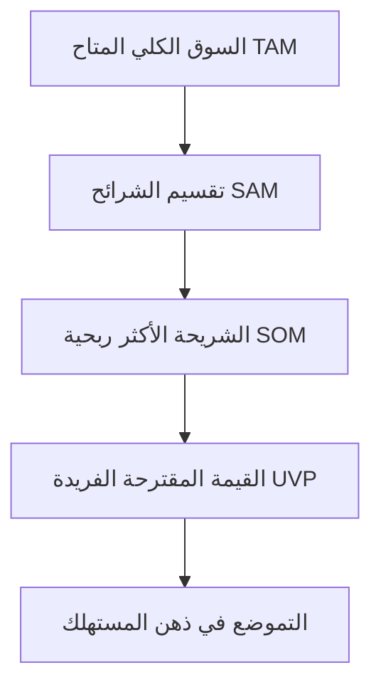

# 👑 OTB Growth Academy — Sprint Day 01
## تحليل السوق الاستراتيجي وبناء الهوية وتموضع البراند (Strategic Market Analysis & Brand Positioning)

> **شعار وكالة OTB:** *"استراتيجيات جريئة.. نتائج حقيقية | Bold Strategies. Real Results"*  
> **الهتاف والتموضع:** *"We Are OTB — The City Kings" 👑*  
> **المستهدفون:** فريق الاستراتيجية (Brand Strategists)، مدراء الحسابات (Account Managers)، كتاب المحتوى (Copywriters)، ورؤساء الأقسام.  
> **المدة المقررة:** 90 دقيقة تدريبية + 45 دقيقة تطبيق عملي.

---

### 🎯 1. أهداف جلسة اليوم الأول (Learning Objectives)
بنهاية جلسة اليوم، سيكون كل عضو في الفريق قادراً على:
1. تطبيق نموذج **STP (Segmentation, Targeting, Positioning)** على أي براند مصري/عربي في قطاعات الأغذية (F&B)، التجارة الإلكترونية (E-Commerce)، أو الخدمات والعيادات الطبية.
2. استخراج وصياغة **شخصية العميل المثالي (Buyer Persona)** الدقيقة القائمة على الألم النفسي (Pain Points) والدافع الشرائي الفعلي وليس مجرد بيانات ديموغرافية سطحية.
3. تفكيك وبناء الهوية المؤسسية بناءً على نموذج **النمط النفسي (The Ruler & The Creator Archetype)** المعتمد في OTB.
4. صياغة نبرة الصوت (Tone of Voice) للبراند وتحويلها إلى ميثاق كتابي يمنع تضارب المحتوى والتصاميم.

---

### 📊 2. الإطار النظري والتكتيكي (Core Frameworks)

#### أ. نموذج STP في السوق الواقعي (Real-World STP Execution)
* **Segmentation (التقسيم):** تقسيم السوق وفق 4 أبعاد حاسمة:
  * *السلوكي (Behavioral):* معدل تكرار الشراء، الحساسية للسعر، الاستجابة للعروض والخصومات.
  * *النفسي (Psychographic):* المكانة الاجتماعية (Social Status)، البحث عن التميز، الرغبة في الراحة وتوفير الوقت.
  * *الديموغرافي والجغرافي (Demographic & Geographic):* القاهرة الكبرى، الإسكندرية، الدلتا، وتحديد مناطق التوصيل والنفوذ.
* **Targeting (الاستهداف):** تحديد الشريحة ذات أعلى قيمة عمرية للعميل (Highest LTV) وأقل تكلفة استحواذ (Lowest CAC).
* **Positioning (التموضع):** صياغة معادلة التموضع التنافسي:
  $$\text{Positioning Statement} = \text{[Target Audience]} + \text{[Category]} + \text{[Differentiating Benefit]} + \text{[Reason to Believe]}$$

#### ب. النمط النفسي لـ OTB: The Ruler & The Creator 👑
في OTB، لا نصنع محتوى عادياً يمر مرور الكرام؛ نحن نبني علامات تجارية تتصدر السوق:
* **The Ruler (الملك/القائد):** فرض الهيبة السوقية، الثقة المطلقة في جودة المنتج، الحديث من موقع الخبير المتمكن.
* **The Creator (المبدع/المبتكر):** تقديم أفكار خارج الصندوق (Out of The Box)، كسر الملل البصري، وصناعة تريندات جديدة بدلاً من اللحاق بها.

---

### 💼 3. دراسات حالة من عملاء OTB الفعليين (Case Studies)

| العميل / البراند | القطاع | التحدي السابق | الاستراتيجية والتموضع المطبق في OTB | النتيجة المحققة |
|---|---|---|---|---|
| **MIX Coffee** | أغذية ومشروبات (F&B / Specialty Coffee) | منافسة شرسة مع البراندات الكبرى وضعف التميز البصري. | تموضع كوجهة أولى لتجربة القهوة الفاخرة للشباب ورواد الأعمال + هوية داكنة راقية. | زيادة تفاعل الحساب بنسبة 180% ومضاعفة المبيعات اليومية للفروع. |
| **Rancho's EG** | مطاعم وبرجر سريع | حرق أسعار وعروض غير مجدية تسببت في انخفاض الهامش الربحي. | إعادة هيكلة القائمة وربط البراند بتجربة الطعم الملحمي الحصري والجودة الفائقة. | رفع معدل إعادة الطلب (Retention Rate) إلى 36.8% وتحقيق أعلى استقرار تشغيلي. |
| **Dr. Zaghloul Jewelry** | مجوهرات وتجارة فاخرة | انعدام الثقة في طلب قطع الذهب والمجوهرات عبر السوشيال ميديا. | التركيز على زاوية الأمان والمصداقية والقصص المرئية الحصرية لكل قطعة. | تحقيق مبيعات مباشرة وتوليد ليدز عالية الجودة بمعدل ROAS يتجاوز 7.5x. |

---

### 🛠️ 4. التكليف التطبيقي الفوري (Day 1 Team Workshop)
* **المطلوب من كل متدرب / قسم:**
  1. اختيار أحد عملاء الوكالة الحاليين أو عميل جديد قيد الاستقبال (Onboarding).
  2. ملء **وثيقة البريف الاستراتيجي (Brand Discovery Sheet)**.
  3. استخراج 3 زوايا تسويقية غير تقليدية (Unconventional Angles) تستغل فجوات المنافسين في السوق.

---
**OTB Agency — We Are The City Kings 👑**  
*القاهرة · +20 100 808 0295 · otbagency5@gmail.com*
