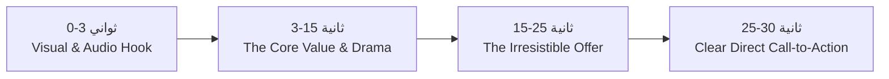

# 👑 OTB Growth Academy — Sprint Day 02
## محرك الكرييتف الإعلاني والكوبي رايتنج وسيكولوجية الفيديو القصير (Creative Engine & Viral Copywriting)

> **شعار وكالة OTB:** *"استراتيجيات جريئة.. نتائج حقيقية | Bold Strategies. Real Results"*  
> **الهتاف والتموضع:** *"We Are OTB — The City Kings" 👑*  
> **المستهدفون:** صناع المحتوى (Content Creators)، كتاب الإعلانات (Copywriters)، مصممو الجرافيك والموشن (Designers & Video Editors).  
> **المدة المقررة:** 90 دقيقة تدريبية + 45 دقيقة ورشة كتابة وإنتاج.

---

### 🎯 1. أهداف جلسة اليوم الثاني (Learning Objectives)
1. إتقان صياغة الإعلانات التحويلية باستخدام معادلات **AIDA**, **PAS**, و **BAB**.
2. تطبيق **قاعدة الثواني الـ 3 الأولى (The 3-Second Hook Rule)** في الفيديوهات القصيرة (Reels, TikTok, Shorts).
3. بناء **مصفوفة المحتوى الرباعية (The 4-Quadrant Content Matrix)** للجمع بين التفاعل الفيروسي والمبيعات المباشرة.
4. كتابة اسكريبتات إعلانية مخصصة لقطاعات المطاعم والتجارة الإلكترونية ترفع معدل المشاهدة للاكتمال (Retention & Hold Rate).

---

### ✍️ 2. نماذج الكوبي رايتنج الإعلاني المعتمدة في OTB

#### أ. نموذج PAS (Problem - Agitation - Solution)
*مثال تطبيقي لقطاع المطاعم / البرجر:*
* **Problem (المشكلة):** "تعبت من ساندوتشات البرجر اللي كلها عيش واللحمة ملهاش طعم؟"
* **Agitation (تهويل المشكلة):** "بتدفع مبلغ محترم وفي الآخر بيجيلك بارد والجبنة مجلدة وتندم على فلوس الخروجة."
* **Solution (الحل الحصري):** "في Rancho's مش بنعمل برجر عادي.. قطمة واحدة من الـ Smoked Double Beef بالصوص السري وهتعرف يعني إيه برجر ملوك حقيقي. اطلب دلوقتي العرض الملكي من اللينك ويوصلك سخن نار!"

#### ب. نموذج AIDA (Attention - Interest - Desire - Action)
* **Attention (الهوك الخاطف):** "سر ما بيقولهوش غير رواد الأعمال الكبار في شرب القهوة!"
* **Interest (بناء الفضول):** "الفرق بين يوم عادي ويوم بتنتج فيه بتركيز 100% هو جودة حبة البن وتحميصتها."
* **Desire (خلق الرغبة):** "في MIX Coffee وفرنالك حبوب البن المختص الإثيوبي المحمصة طازة في نفس الأسبوع عشان تاخد جرعة طاقتك صح."
* **Action (التحفيز على الفعل):** "زور أقرب فرع ليك النهارده أو اطلب الباكت الأونلاين وخد شحن مجاني لأول طلب!"

---

### 🎬 3. تشريح الفيديو الفيرال الناجح (Viral Reel Anatomy)

#### مؤشرات أداء الفيديو الإعلاني التي نقيسها:
1. **Hook Rate (3s Views / Impressions):** الهدف أكثر من **35%**.
2. **Hold Rate (ThruPlays / Impressions):** الهدف أكثر من **15%**.
3. **Outbound CTR:** الهدف أكثر من **2.5%** للإعلانات الممولة.

---

### 🛠️ 4. التكليف التطبيقي الفوري (Day 2 Team Workshop)
* **المطلوب من الفريق:**
  1. كتابة 3 نصوص إعلانية بـ 3 زوايا مختلفة (زاوية فكاهية، زاوية خوف من الفوات FOMO، زاوية فخامة اجتماعية).
  2. تصميم اسكريبت ستوري بورد (Storyboard Script) لريل مدته 20 ثانية جاهز للتصوير والمونتاج.

---
**OTB Agency — We Are The City Kings 👑**
