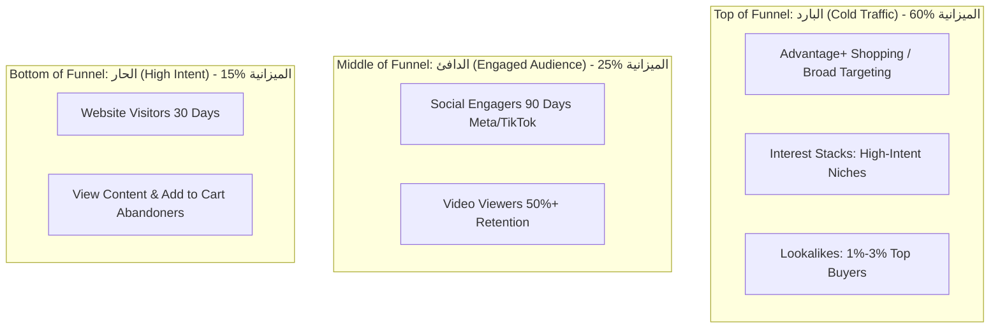

# 👑 OTB Growth Academy — Sprint Day 03
## ميديا بايينج الأداء على ميتا وتيك توك وسكيلينج الـ ROAS (Performance Media Buying & Scaling)

> **شعار وكالة OTB:** *"استراتيجيات جريئة.. نتائج حقيقية | Bold Strategies. Real Results"*  
> **الهتاف والتموضع:** *"We Are OTB — The City Kings" 👑*  
> **المستهدفون:** ميديا بايرز (Media Buyers)، مسؤولو الحملات الممولة، ومدراء الحسابات.  
> **المدة المقررة:** 90 دقيقة تدريبية + 45 دقيقة تحليل حسابات إعلانية مباشرة.

---

### 🎯 1. أهداف جلسة اليوم الثالث (Learning Objectives)
1. بناء الهيكل الحسابي الإعلاني المتقدم **(Account Architecture: CBO vs ABO & Advantage+)**.
2. ضبط التتبع الرقمي المتقدم عبر **Conversions API (CAPI) & Pixel Setup** وحل أزمة تتبع iOS 14.5+.
3. حساب وإدارة معادلات الجدوى المالية: **ROAS, CPA, CAC, AOV, LTV, Contribution Margin**.
4. تطبيق استراتيجيات الـ Scaling بنوعيها: **التوسع الرأسي (Vertical Scaling)** و**التوسع الأفقي (Horizontal Scaling)** للوصول إلى ميزانيات تفوق \$10,000 شهرياً بأمان.

---

### 📈 2. هيكل الحملات الإعلانية المعتمد في OTB (Full-Funnel Media Buying)

---

### 🧮 3. الرياضيات المالية للميديا باير المحترف (Media Buying Financial Formulas)

1. **العائد على الإنفاق الإعلاني (ROAS):**
   $$\text{ROAS} = \frac{\text{Total Revenue Generated from Ads}}{\text{Total Ad Spend}}$$
2. **نقطة التعادل الإعلانية (Break-Even ROAS):**
   $$\text{BE ROAS} = \frac{1}{\text{Gross Profit Margin %}}$$
3. **تكلفة الاستحواذ على العميل (CAC):**
   $$\text{CAC} = \frac{\text{Total Ad Spend} + \text{Direct Acquisition Costs}}{\text{Total New Customers Acquired}}$$

---

### ⚡ 4. شجرة قرارات سكيلينج الحملات (Scaling Decision Tree)

* **متى نقوم بالـ Scaling؟**
  * إذا كان الـ ROAS أعلى من الـ Target بنسبة **25%+** لمدة **3 أيام متتالية**.
  * إذا كان معدل الـ Frequency أقل من **2.2** في حملات الـ TOFU.
* **كيف نقوم بالـ Scaling؟**
  * **Vertical:** زيادة الميزانية بمقدار **20% كل 48-72 ساعة** لمنع إعادة دخول الحملة في مرحلة التعلم (Learning Phase).
  * **Horizontal:** مضاعفة الحملة الرابحة وفتح الاستهداف الواسع (Broad) مع اختبار 3 زوايا إبداعية جديدة (New Creatives).

---

### 🛠️ 5. التكليف التطبيقي الفوري (Day 3 Team Workshop)
* **المطلوب من كل ميديا باير:**
  1. مراجعة حساب إعلاني نشط لأحد عملاء OTB وتدقيق جودة مطابقة الأحداث (Event Match Quality) للـ CAPI.
  2. إعداد مصفوفة الميزانية الأسبوعية وجدول الـ Testing & Scaling لعميل مستهدف.

---
**OTB Agency — We Are The City Kings 👑**
