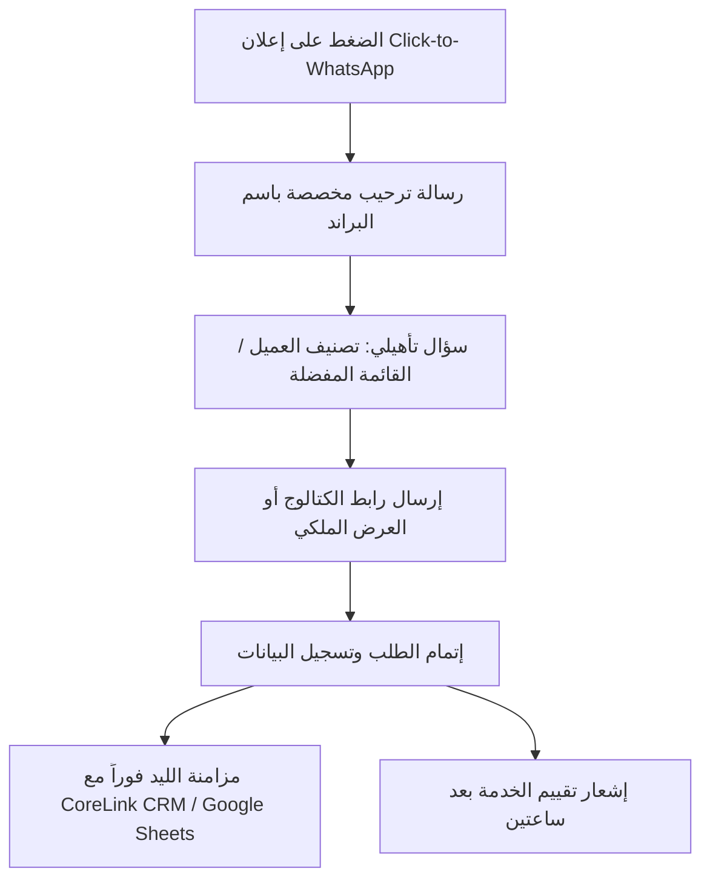

# 👑 OTB Growth Academy — Sprint Day 04
## الذكاء الاصطناعي التسويقي وهندسة الأوامر وأتمتة الليدز (AI Marketing & Growth Automation)

> **شعار وكالة OTB:** *"استراتيجيات جريئة.. نتائج حقيقية | Bold Strategies. Real Results"*  
> **الهتاف والتموضع:** *"We Are OTB — The City Kings" 👑*  
> **المستهدفون:** جميع أعضاء الفريق ورؤساء الأقسام (Cross-Functional).  
> **المدة المقررة:** 90 دقيقة تدريبية + 45 دقيقة تطبيق أوامر AI وبناء مسار أتمتة.

---

### 🎯 1. أهداف جلسة اليوم الرابع (Learning Objectives)
1. إتقان إطار هندسة الأوامر المتقدم **(RCIC Framework: Role, Context, Instruction, Constraint)**.
2. أتمتة دورة إنتاج المحتوى المرئي والإعلاني باستخدام أدوات الـ AI الحديثة (Midjourney, Gemini, Claude).
3. ربط وتفعيل قنوات المراسلة المباشرة عبر **WhatsApp Business API & Chatbots** لتحويل المحادثات إلى مبيعات فورية.
4. إعداد مسارات استعادة السلات المتروكة (Abandoned Cart Automation) بالبريد والواتساب لتحقيق 20%+ مبيعات إضافية مسترجعة.

---

### 🤖 2. إطار هندسة الأوامر المعتمد في OTB (RCIC Prompting Architecture)

| العنصر | الغرض والتعريف | مثال تطبيقي لكتابة إعلان لـ OTB |
|---|---|---|
| **Role (الدور)** | تحديد هوية الذكاء الاصطناعي وخبرته | "أنت Head of Copywriting و Growth Marketer خبير بخبرة 10 سنوات في السوق المصري." |
| **Context (السياق)** | تزويد النموذج بخلفية البيزنس والجمهور | "العميل هو مطعم برجر فاخر (Rancho's) يستهدف الشباب في القاهرة بمتوسط دخل مرتفع." |
| **Instruction (التعليمات)** | المهمة المطلوب تنفيذها بدقة | "اكتب 3 اسكريبتات لريلز قصيرة مدتها 15 ثانية تركز على الطعم الملحمي والصوصات الخاصة." |
| **Constraint (القيود)** | المحددات والشروط والممنوعات | "ممنوع استخدام عبارات مبتذلة مثل (أشهى المأكولات)؛ النبرة يجب أن تكون جريئة وثقة ملكية بالعامية المصرية الراقية." |

---

### 💬 3. مسار أتمتة الـ WhatsApp Business API لعملاء OTB

---

### 🛠️ 4. التكليف التطبيقي الفوري (Day 4 Team Workshop)
* **المطلوب من كل قسم:**
  1. تجربة 3 أوامر RCIC من دليل **OTB Prompt Engineering Bible** لإنتاج محتوى وإعلانات عميل حقيقي.
  2. رسم مخطط مسار أتمتة رسائل ترحيبية وعروض ترويجية عبر WhatsApp API لأحد عملاء الوكالة.

---
**OTB Agency — We Are The City Kings 👑**
